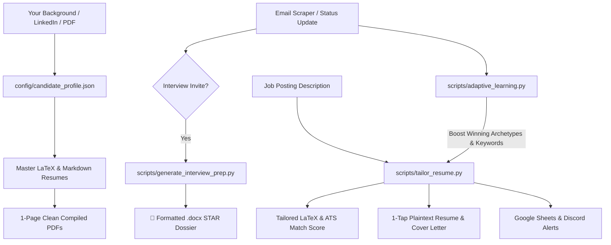

# 🎯 Adaptive Resume & Career Automation Engine

> **AI-Powered Career Ecosystem**: Automated 1-page LaTeX compilation, real-time ATS tailoring, machine-learning win feedback, autonomous email scraping, **custom `.docx` STAR interview prep dossiers**, Google Sheets live sync, and Discord notifications.

---

## ⚡ Quick Start: Zero to Master Resume & Interview Prep

You can give this repository to **Antigravity** (or any AI coding assistant), and it will build your entire system automatically.

### 💬 Just Say to the AI:
> *"Hey Antigravity, I just cloned this repository. Please read `AGENT_INSTRUCTIONS.md`, ingest my resume/background, and initialize my master resumes, tailoring engine, and interview prep system!"*

---

## 🌟 Key Features



1. **📄 Gold-Standard 1-Page LaTeX Templates**:
   - Modern, compact, high-contrast ATS-friendly typography (SWE, Embedded, ECE, AI).
   - Strict vertical spacing guarantees a perfect single-page layout with zero overflow.

2. **🎯 Real-Time ATS Match Scoring & Keyword Tailoring**:
   - Parses job descriptions, extracts required technologies, and calculates candidate match score.
   - Generates 1-tap copy/paste plaintext resume blocks and matching cover letters.

3. **🎤 Auto-Generated STAR Interview Prep Dossiers (`.docx`)**:
   - Automatically generates a role-specific Microsoft Word (`.docx`) interview prep packet with:
     - 2-Minute Executive Pitch ("Tell me about yourself")
     - Structured **STAR Story Bank** (Situation, Task, Action, Result) in formatted tables
     - Difficult technical/architecture questions and deep answers
     - Behavioral curveball answers (Weaknesses, Disagreements)
     - High-impact reverse questions to ask the interviewer

4. **📬 Autonomous Email Scraper & Learning Feedback Loop**:
   - Scans Gmail for application confirmations, rejections, OAs, and interview invites.
   - Dynamically weights winning phrases and templates for future job applications.
   - **Auto-generates the `.docx` Interview Prep dossier** the moment an interview email is detected!

5. **📊 Google Sheets Live Dashboard & Discord Notifications**:
   - Live synchronization with Google Sheets for easy mobile/desktop viewing.
   - Rich Discord webhook embeds with attached PDFs and interview prep files.

---

## 📁 Repository Structure

```
adaptive-resume-ai/
├── .github/workflows/
│   └── compile_resumes.yml        # CI/CD to auto-compile all resumes to PDF on push
├── AGENT_INSTRUCTIONS.md          # Master instructions for AI assistants (Antigravity/Cursor)
├── README.md                      # Documentation & Quickstart
├── requirements.txt               # Python dependencies (python-docx, requests, etc.)
├── .env.example                   # Environment configuration template
├── config/
│   ├── candidate_profile.json     # Your background, experiences, projects, skills
│   └── job_preferences.json       # Target roles, locations, keywords, salary goals
├── templates/
│   ├── latex/                     # 1-page LaTeX templates (SWE, Embedded, ECE, AI)
│   └── markdown/                  # Master resume & cover letter templates
├── scripts/
│   ├── tailor_resume.py           # ATS keyword analyzer & tailored PDF generator
│   ├── generate_interview_prep.py # STAR method .docx Interview Prep generator
│   ├── adaptive_learning.py       # Win-rate learning engine & analytics updater
│   ├── sync_gmail_tracker.py      # Autonomous Gmail scraper & status tracker
│   ├── sync_google_sheets.py      # Live Google Sheets sync
│   ├── google_sheets_apps_script.js # Apps script for 1-click Google Sheet integration
│   ├── discord_alerts.py          # Rich Discord notifications
│   ├── compile_resumes.py         # Cross-platform LaTeX / Tectonic compiler
│   ├── track_applications.py      # Application tracker & CSV exporter
│   └── fetch_job_leads.py         # Job board lead fetcher
├── resumes/
│   ├── master/                    # Master .tex and .pdf resumes
│   └── tailored/                  # Generated company-specific resumes (LaTeX & PDF)
├── interview_prep/                # Generated .docx and markdown interview dossiers
├── applications/                  # Application notes & jobs_tracker.csv
└── analytics/                     # Performance dashboard & learning data
```

---

## 🛠️ CLI Usage Guide

```bash
# 1. Tailor resume for a job posting
python3 scripts/tailor_resume.py --company "Tesla" --role "Firmware Engineer" --job-text "..."

# 2. Generate STAR Interview Prep Dossier (.docx)
python3 scripts/generate_interview_prep.py --company "Tesla" --role "Firmware Engineer"

# 3. Compile all LaTeX resumes to PDF
python3 scripts/compile_resumes.py --all

# 4. Scan Gmail for status updates & auto-trigger interview prep
python3 scripts/sync_gmail_tracker.py

# 5. Sync to Google Sheets
python3 scripts/sync_google_sheets.py

# 6. Recalculate learning analytics & refresh dashboard
python3 scripts/adaptive_learning.py
```