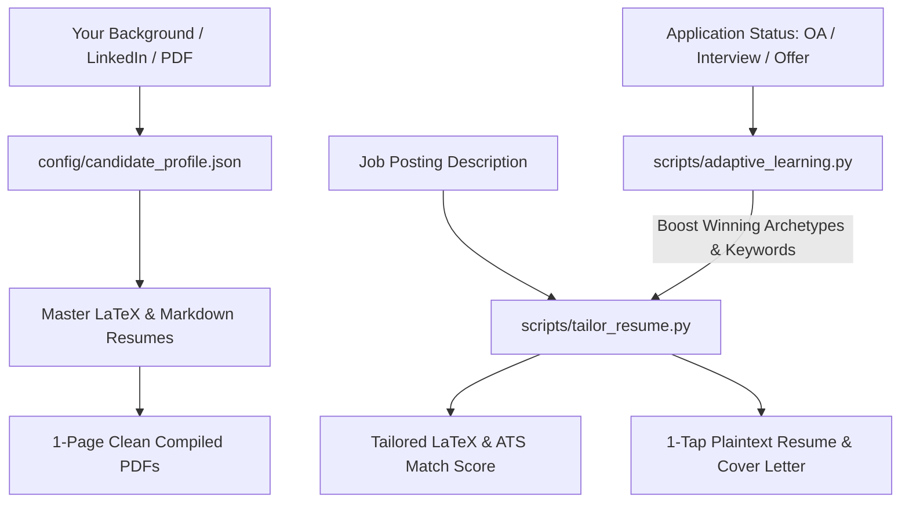

# 🎯 Adaptive Resume & Career Automation Engine

> **AI-Powered Resume Ecosystem**: Automated LaTeX compilation, single-page ATS tailoring, multi-track master resumes, and an adaptive machine-learning feedback loop that optimizes your resumes based on real application wins (interviews & offers).

---

## ⚡ Quick Start: Zero to Master Resume in 60 Seconds

You can give this repository to **Antigravity** (or any AI coding assistant), and it will build your entire resume system automatically.

### 💬 Just Say to the AI:
> *"Hey Antigravity, I just cloned this repository. Please read `AGENT_INSTRUCTIONS.md`, ingest my resume/background, and initialize my master resumes and tailoring engine!"*

---

## 🌟 Key Features



1. **📄 Gold-Standard 1-Page LaTeX Templates**:
   - Modern, compact, high-contrast, ATS-friendly typography.
   - Zero overflow: strict vertical spacing guarantees a perfect single-page layout.
   - Pre-configured archetypes: **Software / SWE**, **Embedded Systems / Firmware**, **Hardware / Digital EE**, **Robotics & Controls**, and **Data / AI**.

2. **🎯 Real-Time ATS Match Scoring & Keyword Tailoring**:
   - Parses job descriptions and extracts required technologies, tools, and domain concepts.
   - Calculates candidate match percentage and identifies missing keywords to incorporate naturally.
   - Generates 1-tap copy/paste plaintext resume blocks for stubborn application portals (Workday, Taleo, Greenhouse).
   - Generates matching company-tailored cover letters.

3. **🧠 Adaptive Learning Feedback Loop**:
   - Tracks application outcomes (`Applied`, `OA / Screen`, `Technical`, `Final Round`, `Offer`, `Rejected`).
   - Learns which resume archetypes, project bullet formulations, and keywords win recruiter responses.
   - Dynamically weights winning phrases and templates for future job applications.

4. **📊 Application Tracker & Analytics Dashboard**:
   - Auto-generates structured markdown logs in `applications/`.
   - Exports clean `applications/jobs_tracker.csv` for spreadsheet management.
   - Visual dashboard in `analytics/Resume_Performance_Dashboard.md`.

---

## 📁 Repository Structure

```
adaptive-resume-ai/
├── .github/workflows/
│   └── compile_resumes.yml        # CI/CD to auto-compile all resumes to PDF on push
├── AGENT_INSTRUCTIONS.md          # Master instructions for AI assistants (Antigravity/Cursor)
├── README.md                      # Documentation & Quickstart
├── requirements.txt               # Python dependencies
├── config/
│   ├── candidate_profile.json     # Your background, experiences, projects, skills
│   └── job_preferences.json       # Target roles, locations, keywords, salary goals
├── templates/
│   ├── latex/                     # 1-page LaTeX templates (SWE, Embedded, ECE, AI)
│   └── markdown/                  # Master resume & cover letter templates
├── scripts/
│   ├── tailor_resume.py           # ATS keyword analyzer & tailored PDF generator
│   ├── adaptive_learning.py       # Win-rate learning engine & analytics updater
│   ├── compile_resumes.py         # Cross-platform LaTeX / Tectonic compiler
│   ├── track_applications.py      # Application tracker & CSV exporter
│   └── fetch_job_leads.py         # Job board lead fetcher
├── resumes/
│   ├── master/                    # Master .tex and .pdf resumes
│   └── tailored/                  # Generated company-specific resumes (LaTeX & PDF)
├── applications/                  # Application notes & jobs_tracker.csv
└── analytics/                     # Performance dashboard & learning data
```

---

## 🛠️ CLI Usage Guide

### 1. Tailor Resume for a Job Posting
```bash
python3 scripts/tailor_resume.py --company "Tesla" --role "Firmware Engineer" --job-text "Looking for C++, RTOS, FreeRTOS, ESP32, CAN bus, PID control..."
```

### 2. Compile All LaTeX Resumes to PDF
```bash
python3 scripts/compile_resumes.py --all
```

### 3. Log / Update Application & Sync Tracker
```bash
# Sync markdown application notes to CSV
python3 scripts/track_applications.py --sync
```

### 4. Recalculate Learning Analytics & Update Dashboard
```bash
python3 scripts/adaptive_learning.py
```

---

## 📦 Requirements & Tooling

- **Python**: 3.9+ (Standard libraries + optional `requests`, `beautifulsoup4`)
- **LaTeX Compiler**: [Tectonic](https://tectonic-typesetting.github.io/) (recommended, zero-config) or standard `pdflatex` / `latexmk`.
  - Windows: `winget install tectonic` or use via WSL `sudo apt install tectonic` or `texlive`.
  - macOS: `brew install tectonic`
  - Linux: `sudo apt install tectonic` or `sudo pacman -S tectonic`