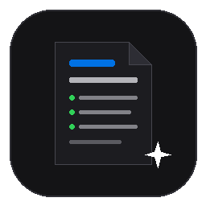
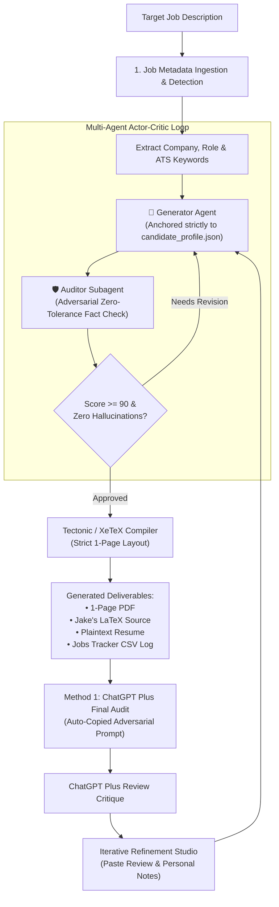

# ⚡ Adaptive Resume AI • Executive Career Studio

<p align="center">
  
</p>

<p align="center">
  <strong>Multi-Agent Actor-Critic Resume Adaptation Engine & Executive Studio</strong><br />
  <em>Zero-Hallucination Fact Verification • 1-Page Resumake/Jake's Standard • Real-Time Web Studio • ChatGPT Plus Audit Loop</em>
</p>

<p align="center">
  
  
  
  
  
</p>

---

## 🚀 1-Click Automated Setup

This repository is fully self-configuring. Clone the repo and run the setup script:

### Windows (1-Click)
```bat
git clone https://github.com/justintime1888/adaptive-resume-ai.git
cd adaptive-resume-ai
setup.bat
```
*(Or in PowerShell: `.\setup.ps1`)*

**What `setup.bat` / `setup.ps1` automatically does for you:**
1. ✅ Verifies your Python 3.9+ installation.
2. ✅ Installs required dependencies (`pypdf`, `Pillow`, `requests`).
3. ✅ Detects your local LaTeX engine (`tectonic`, `pdflatex`, or WSL Tectonic).
4. ✅ Provisions a custom Apple-style squircle desktop icon in `~/.icons/`.
5. ✅ Creates an **`Adaptive Resume AI`** shortcut directly on your Desktop.
6. ✅ Launches the **Executive Web Studio** at `http://localhost:8765`.

---

## 🌟 Architecture & Dual-Agent Engine



---

## ✨ Flagship Capabilities

### 1. 🖥️ Executive Web Studio UI (`http://localhost:8765`)
- **Apple / Jony Ive Aesthetic:** Dark glassmorphism, SF Pro typography, refined spacing, and reactive pipeline visualization.
- **Auto-Detection:** Automatically parses company names, role titles, and ATS keywords from unstructured job text.
- **Embedded PDF Viewer:** Live single-page preview updated in real time via Tectonic.

### 2. 🔄 Iterative Refinement Studio (All-in-One Feedback Loop)
- **Paste ChatGPT Plus Audit Critiques:** Directly paste the adversarial review, letter grade, and line-item critiques you receive from external AI audits.
- **Personal Directives:** Add custom constraints (e.g. *"Won 2nd place at Rowan, not 1st"*, *"Expected Dec 2027 graduation"*, *"Exclude semiconductor devices"*, *"Clean title"*).
- **1-Click Re-Audit:** With one tap, updates ground truth facts, removes unbacked metrics, re-compiles the PDF, and logs the revision cycle.

### 3. 🛡️ Adversarial Anti-Hallucination Policy
- Every claim, employer, metric, and tool is checked against [`config/candidate_profile.json`](config/candidate_profile.json) and [`resumes/master/Master_Resume.md`](resumes/master/Master_Resume.md).
- Zero unbacked metrics (`<0.1%`, `900%`, ungrounded speedups).
- Dual graduation timeline handling:
  - **Internship / Co-op Track:** `Expected December 2027` (satisfies later graduation mandates).
  - **Standard Track:** `Expected May 2027`.

### 4. 📄 Gold-Standard 1-Page Resumake / Jake's Resume Standard
- Uses the standard **Resumake / Jake's Resume** LaTeX architecture.
- Optimized vertical geometry (`0.4in` margins, compact section titles, nested coursework sub-bullets) guarantees a strict **single-page PDF** with zero text spillover.

---

## 🛠️ CLI & Manual Usage

You can also run the engine directly from the command line:

```bash
# Adapt resume for Qualcomm Technologies
python scripts/refinement_loop.py --company "Qualcomm Technologies" --role "Hardware Engineering Intern"

# Pass a custom job description file
python scripts/refinement_loop.py --company "Apple" --role "Embedded Systems Engineer" --job-file "path/to/job.txt"

# Launch the Web Studio manually
python scripts/web_ui.py
# or double-click start.bat
```

---

## 📁 Repository Structure

```
adaptive-resume-ai/
├── setup.bat                  # 1-Click Windows self-setup wrapper
├── setup.ps1                  # PowerShell automated setup & environment provisioner
├── start.bat                  # Instant double-click launcher
├── requirements.txt           # Minimal Python dependencies (pypdf, Pillow, requests)
├── README.md                  # System documentation & quickstart
├── config/
│   ├── candidate_profile.json # Ground-truth experiences, skills, projects, education
│   └── job_preferences.json   # Role preferences & target domains
├── web/
│   └── index.html             # Executive Studio frontend (TailwindCSS, Glassmorphism)
├── scripts/
│   ├── web_ui.py              # Studio HTTP server & API endpoints
│   ├── refinement_loop.py     # Multi-agent Actor-Critic adaptation engine
│   ├── resume_verifier.py     # Anti-hallucination verification engine
│   ├── ats_checker.py         # Keyword matcher & power verb auditor
│   ├── compile_resumes.py     # Cross-platform Tectonic / XeTeX compiler
│   ├── launch_studio.vbs      # Headless Windows desktop launcher
│   └── track_applications.py  # CSV application logger
├── resumes/
│   ├── master/                # Master LaTeX & Markdown resumes
│   └── tailored/              # Generated single-page PDFs & LaTeX sources
├── applications/              # Markdown application records & ChatGPT prompts
└── assets/                    # Desktop icon (.ico) & high-res artwork
```

---

## 🤝 Single Source of Truth

To update your background or add new experiences, simply update [`config/candidate_profile.json`](config/candidate_profile.json). The multi-agent generator will immediately draw from your updated facts across all future tailored applications.

---

<p align="center">
  Crafted with precision for elite engineering applications (SpaceX, Apple, Qualcomm, Anduril).
</p>