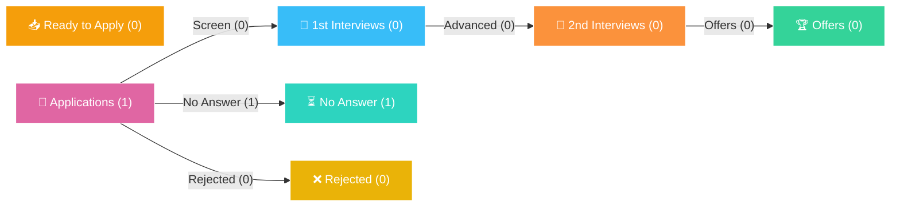

---
tags:
  - career/pipeline-sankey
  - career/dashboard
updated: "2026-09-10 20:59"
---

# 📊 Job Search Pipeline & Funnel (Sankey View)

> **Real-Time Job Funnel Telemetry** &bull; 1-Click Interactive HTML Visualization:  
> 🔗 **[Open Interactive Sankey Dashboard in Browser](file://C:/Users/jstnp/Projects/adaptive-resume-ai/analytics/Job_Search_Sankey.html)**

---

## 📈 Pipeline Snapshot & Conversion KPIs

| 📝 Total Tracked | 📤 Applications Sent | 🎯 1st Interviews / Screen | 🏆 2nd / Technical | 🎉 Offers | 📊 Screen Conversion |
| :---: | :---: | :---: | :---: | :---: | :---: |
| **1** | **1** | **0** | **0** | **0** | **0.0%** |

---

## 🌊 Application Flow (SankeyMATIC Compliant)

You can copy and paste the block below directly into [SankeyMATIC.com](https://sankeymatic.com/build/) to reproduce the exact diagram:

```text
// Application Funnel
Applications [1] No Answer
```

---

## 🧭 Visual Flow Diagram



---

## ⚡ 1-Click Actions
- **Open Interactive Browser Sankey:** [Job_Search_Sankey.html](file://C:/Users/jstnp/Projects/adaptive-resume-ai/analytics/Job_Search_Sankey.html)
- **Desktop Shortcut:** Double click `Job Pipeline Sankey` on your Desktop to regenerate and open instantly!
