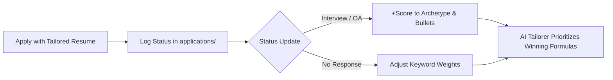

---
tags:
  - career/analytics
last_updated: "2026-08-19 15:45"
---

# 🧠 AI Resume Performance & Learning Analytics Dashboard

> **Adaptive Feedback Loop**: Automatically analyzes your job applications, measures interview response rates across resume archetypes, and optimizes keyword targeting for future applications.

---

## 📊 Conversion Rate by Resume Archetype

| Resume Track & Archetype | Applications Sent | Interviews / Screens | 🎯 Interview Rate | 🎉 Offers |
| :--- | :---: | :---: | :---: | :---: |
| **Software Engineering** | 0 | 0 | N/A | 0 |
| **Embedded Systems & Firmware** | 0 | 0 | N/A | 0 |
| **Robotics & Autonomous Systems** | 0 | 0 | N/A | 0 |
| **Hardware & Digital EE** | 0 | 0 | N/A | 0 |
| **Data Science & AI** | 0 | 0 | N/A | 0 |

---

## 🏆 Highest-Converting Keywords & Skills
Technologies present in resumes that converted to recruiter screens or technical interviews:
> *(Log more applications to discover keyword win rates)*

---

## 🔄 How the Learning Loop Adapts Your Resumes
